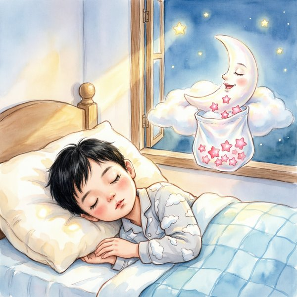

# aliang-kids-story-maker · 儿童故事制作

<p align="center">
  
</p>

## 干什么

按孩子年龄和时长，一条龙做出**儿童故事 + 配音 + 插图**：

1. 选参数：年龄（3-12 岁）、时长（1/2/3/5 分钟）、播音音色
2. AI 生成 3 个不同主题的故事供你挑
3. 写出完整故事正文
4. TTS 配音（系统童声/女声音色，开箱即用）
5. 生成水彩风格绘本插图
6. 整理成 `story.txt` + `audio.mp3` + `cover.png`

## 如何安装

需先安装百炼 CLI（见[仓库根 README](../../README.md#-前置依赖安装百炼-cli)），然后：

```bash
cp -R aliang-kids-story-maker ~/.claude/skills/
```

## 如何使用

对你的 AI 助手说，例如：

```
给 5 岁的孩子做一个 3 分钟的睡前故事，温柔妈妈的声音，要配音和插图
```

AI 会先给 3 个故事选项让你选，再生成正文、配音、插图。

> 音色用系统内置的 `cosyvoice-v3-flash`（如 `longanwen_v3` 温柔妈妈、`longxiaochun_v3` 可爱童声等），**无需克隆**，开箱即用。
