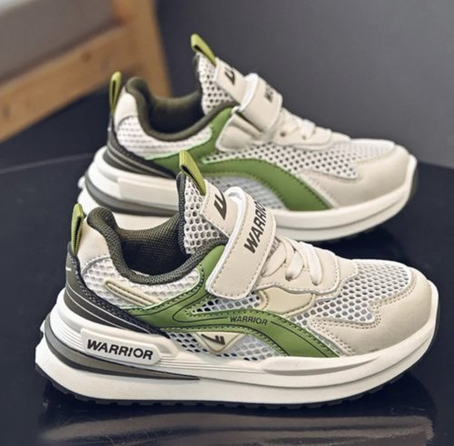
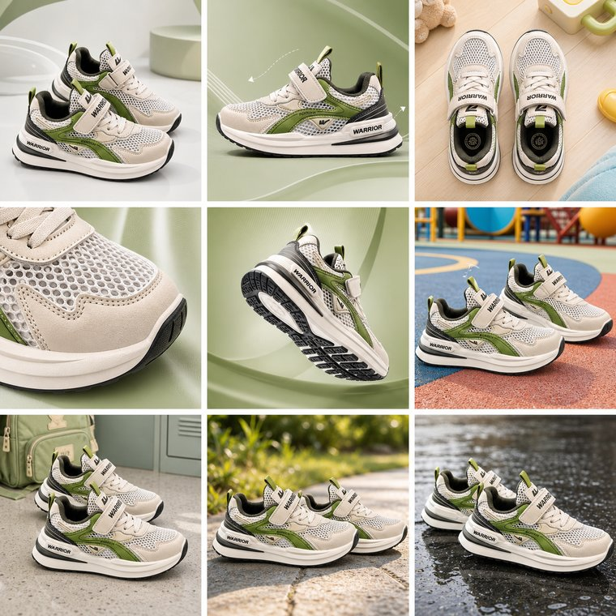

# aliang-product-detail-photos · 电商商品详情图生成

<p align="center">
  
  &nbsp;➜&nbsp;
  
</p>

## 干什么

把一张普通产品图，做成一套专业的电商详情图：

1. **去背景** —— 抠出产品，干净白底
2. **场景规划** —— AI 当电商摄影师，把 N 张图拆成「角度 + 场景」组合
3. **逐张生成** —— 把去背景的产品放进不同场景，输出多角度/多场景详情图

支持 1:1 / 3:4 / 16:9 比例，简约 / 温馨 / 自然 / 科技感等风格。

## 如何安装

需先安装百炼 CLI（见[仓库根 README](../../README.md#-前置依赖安装百炼-cli)），然后：

```bash
cp -R aliang-product-detail-photos ~/.claude/skills/
```

## 如何使用

对你的 AI 助手说，例如：

```
帮我把这张产品图（./保温杯.jpg）做成 5 张电商详情图，3:4 竖图，简约风
```

AI 会先给出拍摄规划表让你确认，再逐张生成，最后整理输出到目录。

> 底层用 `bl image edit`（去背景 + 产品入场景）与 `bl text chat`（产品分析）。
